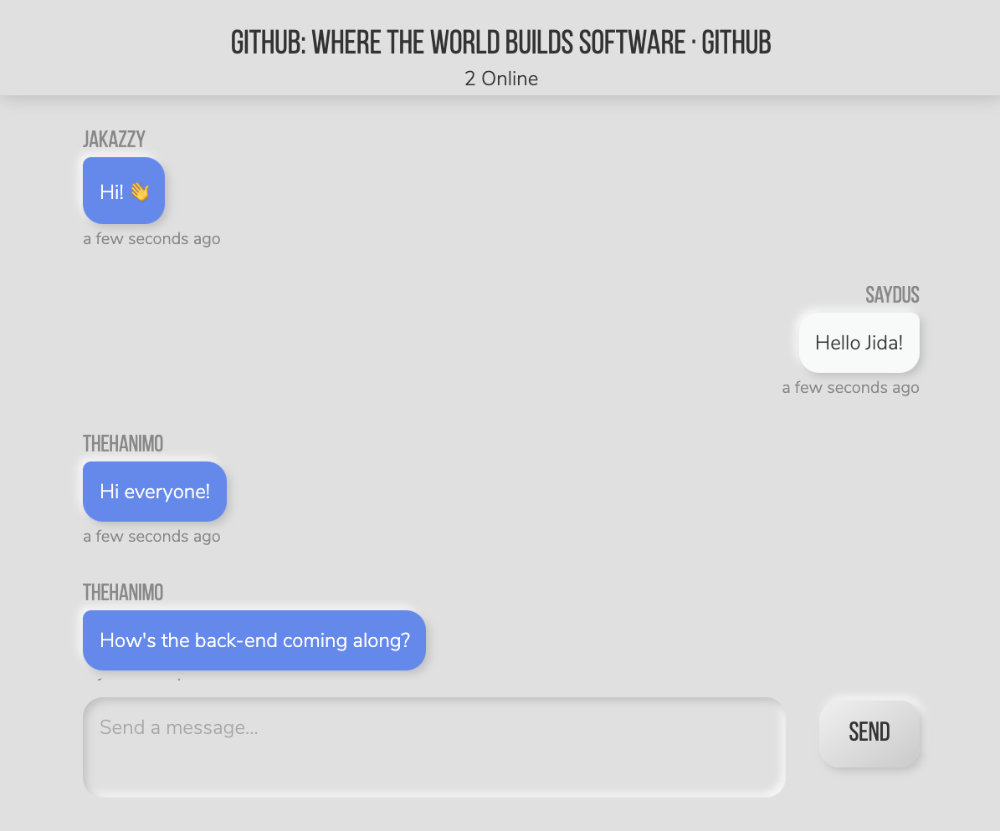
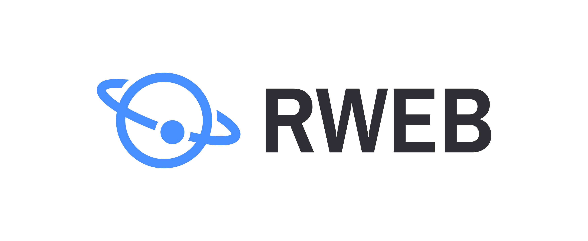

# Livechat

A browser extension that allows you to chat with people in your community browsing the same pages.

<br />
<p align="center">
    

  <h3 align="center">LiveChat</h3>

  <p align="center">
    A browser extension that allows you to chat with people in your community browsing the same pages.
    <br />
    <a href="https://github.com/saydus/livechat#livechat"><strong>Explore the docs »</strong></a>
    <br />
    <br />
    <a href="https://github.com/saydus/livechat#usage">Project Setup</a>
    ·
    <a href="https://github.com/saydus/livechat/issues">Report Bug</a>
    ·
    <a href="https://github.com/saydus/livechat/issues">Request Feature</a>
  </p>
</p>

<!-- TABLE OF CONTENTS -->
<details open="open">
  <summary>Table of Contents</summary>
  <ol>
    <li>
      <a href="#about-the-project">About The Project</a>
      <ul>
        <li><a href="#built-with">Built With</a></li>
      </ul>
    </li>
    <li>
      <a href="#getting-started">Getting Started</a>
      <ul>
        <li><a href="#prerequisites">Prerequisites</a></li>
        <li><a href="#installation">Installation</a></li>
      </ul>
    </li>
    <li><a href="#usage">Usage</a></li>
    <li><a href="#roadmap">Roadmap</a></li>
    <li><a href="#contributing">Contributing</a></li>
    <li><a href="#license">License</a></li>
    <li><a href="#contact">Contact</a></li>
    <li><a href="#acknowledgements">Acknowledgements</a></li>
  </ol>
</details>

<!-- ABOUT THE PROJECT -->

## About The Project

Livechat is a browser extension and a chat application that enables community of enthusiasts discuss and share ideas on a topic. Every website or domain you visit in the browser has a unique chat room. You can discuss, share ideas, deliberate, simply talk to any one that visits the website.

It is a fullstack serverless application that uses [React js and AWS services](https://github.com/saydus/livechat#builtwith)

### Built With

This section lists any major frameworks and technologies were used in building LiveChat

- [AWS AppSync](https://aws.amazon.com/appsync/)
- [Amazon DynamoDB](https://aws.amazon.com/dynamodb/)
- [Amazon Cognito](https://aws.amazon.com/cognito/)
- [React js](https://reactjs.org/)
- [CDK CLI](https://docs.aws.amazon.com/cdk/latest/guide/cli.html)

## Getting Started

This is an example of how you may give instructions on setting up your project locally.
To get a local copy up and running follow these simple example steps.

### Prerequisites

Thes are prerequisites to set up the project and get up and running locally.

- yarn
- Setup an AWS account.

### Installation

## Deploying the back end

1. Clone the [back-end repo](https://github.com/saydus/livechat-backend)

```sh
git clone https://github.com/full-stack-serverless/cdk-appsync-chat.git
```

2. Change into the `cdk-appsync-chat` directory

3. Install dependencies in main folder:

```sh
npm install

# or

yarn
```

3. Deploy to AWS

```sh
cdk deploy
```

Once the project has been deployed, you'll be given the resources needed to configure the client-side React application.

#### Setting up the front end ( & installing the chrome extension)

1. Clone the client application

```sh
git clone git@github.com:saydus/livechat.git
```

2. Change into the client directory:

```sh
cd livechat

```

3. Install the dependencies

```
yarn
```

4.  create a file `aws-exports.js`in the src directory

```
touch src/aws-exports.js
```

5. Update this file `aws-exports.js` with the outputs from deploying the backend after running cdk deploy
```sh
const config = {
  Auth: {
    region: '',
    userPoolId: '',
    userPoolWebClientId: '',
  },
  aws_appsync_graphqlEndpoint:
    '',
  aws_appsync_region: '',
  aws_appsync_authenticationType: 'AMAZON_COGNITO_USER_POOLS',
};

export default config;
```


6. Run the application with the command

```sh

yarn watch
```

7. Now in the browser, open chrome and navigate to the extensions tab (`chrome://extensions/`)

8. On the extreme right, Turn on Developer mode

9. On the left, choose the Load unpacked and select the `build` folder from this project

10. In the browser, select this `React Web Extension Boilerplate` from the list of extensions.
    and chat away


<!-- USAGE EXAMPLES -->

## Usage

Click on extensions and choose the chat extension. The chat up will popup.

<!-- ROADMAP -->

## Roadmap

See the [open issues](https://github.com/saydus/livechat/issues) for features (and known issues).

<!-- CONTRIBUTING -->

## Contributing

Contributions are what make the open source community such an amazing place to be learn, inspire, and create. Any contributions you make are **greatly appreciated**.

1. Fork the Project
2. Create your Feature Branch (`git checkout -b feature/AmazingFeature`)
3. Commit your Changes (`git commit -m 'Add some AmazingFeature'`)
4. Push to the Branch (`git push origin feature/AmazingFeature`)
5. Open a Pull Request

<!-- LICENSE -->

## License

Distributed under the MIT License. See `LICENSE` for more information.

<!-- CONTACT -->

## Contributors

- [saydus](https://github.com/saydus)
- [thehanimo](https://github.com/thehanimo)
- [jakazzy](https://github.com/jakazzy)

## Made possible by
<a href="https://github.com/ElForastero/react-browser-extension-boilerplate">
  
</a>
<a href="https://github.com/adamgiebl/neumorphism/">
  
</a>
